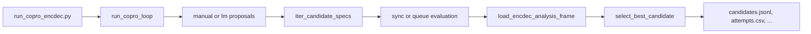

# Running the minimal COPRO enc-dec optimizer

This document describes the COPRO-style encoder prompt optimizer integrated with
the v1 HumanEval enc-dec platform. Use it to propose instruction variants,
evaluate them through the same generate-and-score pipeline as experiment
sweeps, and select the best candidate by HumanEval pass rate.

## What it optimizes

The optimizer varies only encoder prompt variables:

| Optimized | Fixed |
| --- | --- |
| `instructions_start` | Encoder user prompt template |
| `instructions_end` | Decoder prompts |
| | Model routing, compression/budget logic, temperature `0` |

The baseline (worst-case starting point) is:

- `instructions_start`: `"Provide a concise description of the following code."`
- `instructions_end`: `""`

## Algorithm (high level)

The loop follows the DSPy COPRO pattern without importing DSPy at runtime:

1. Start from the baseline instruction pair (or the best candidate from the
   previous depth).
2. Propose **`breadth - 1`** alternative `instructions_start` /
   `instructions_end` pairs, plus the current best → **`breadth` candidates**
   total per depth.
3. Evaluate every candidate on the configured split (tasks × repeats ×
   compression targets).
4. Score each candidate by **pass rate over score-success rows**.
5. Keep the best candidate and advance to the next depth.
6. After `--depth` iterations, return the global best and write artifacts.

**Selection tie-breakers** (in order):

1. Higher pass rate
2. Larger scoreable count
3. Fewer generation/score errors
4. Shorter combined instruction text
5. Lexicographic `candidate_id`

## Implementation overview

```text
scripts/optimization/run_copro_encdec.py   # Typer CLI
src/dr_dspy/optimization/copro.py          # models, loop, evaluation, artifacts
tests/test_optimization_copro.py           # unit tests
```

### End-to-end flow



For each candidate, the implementation:

1. Builds v1 `PredictionSpecRecord`s via `humaneval_encdec_graph()` and
   `humaneval_encdec_task_snapshot()`.
2. Stores COPRO trace metadata in **spec dimensions** (not task inputs), so
   each variant gets a unique `prediction_id`:
   - `optimizer`: `"copro_minimal"`
   - `copro_run_id`, `candidate_id`, `candidate_depth`, `parent_candidate_id`
   - `instructions_digest`, `compression_target`
3. Inserts specs under one experiment name: `copro_minimal_{run_id}`.
4. Runs generation and scoring through existing platform workflows.
5. Aggregates results with `load_encdec_analysis_frame()` grouped by
   `dimensions.candidate_id`.

### Execution modes

| Mode | Flag | Behavior |
| --- | --- | --- |
| **Sync** (default) | `--execution-mode sync` | Insert specs, then call `run_prediction_graph_workflow_once` and `run_score_generation_workflow_once` per spec. No external worker required. Best for tiny smoke runs. |
| **Queue** | `--execution-mode queue` | Submit specs to the DBOS generation queue, poll until runs finish, then batch-rescore with `--rescore-max-in-flight`. Requires a running platform worker. |

### Proposal modes

| Mode | Flag | Behavior |
| --- | --- | --- |
| **Manual** (default) | `--proposal-mode manual` | Fixed alternates from a curated pool plus the carry-forward best. Demo-safe; no LLM call. |
| **LM** | `--proposal-mode lm` | Calls a prompt model via the provider boundary. Requires `--prompt-model`. Uses prior attempt scores as context after depth 0. Strict JSON parsing; fails clearly on malformed output. |

### Output artifacts

Written to `--output-dir`:

| File | Contents |
| --- | --- |
| `candidates.jsonl` | All proposed candidates (one JSON object per line) |
| `attempts.csv` | Per-candidate pass rates and error counts |
| `best_prompt.json` | Best candidate instructions and attempt summary |
| `summary.md` | Human-readable run report |
| `commands.log` | Exact command(s) used |

By default, a short entry is also appended to `docs/testing_logs.md`.

## Prerequisites

- Postgres with v1 platform schema (`DATABASE_URL`, typically
  `postgresql+psycopg:///dr_dspy`)
- API keys in `.env` (`OPENAI_API_KEY` and/or `OPENROUTER_API_KEY` depending on
  model config)
- For **queue mode**: a separate terminal running the platform worker

## Commands

All examples assume the repo root and `uv` environment.

### 1. Tiny manual smoke (recommended first run)

Self-contained sync execution; 2 candidates, 1 depth, 1 task, 1 repeat:

```bash
uv run python scripts/optimization/run_copro_encdec.py \
  --model-config configs/models/gpt54-nano-openai.json \
  --split configs/splits/tiny.json \
  --compression-target 0.5 \
  --breadth 2 \
  --depth 1 \
  --repeats 1 \
  --proposal-mode manual \
  --output-dir artifacts/optimization/copro_smoke
```

### 2. Dry run (no DB, no API calls)

Build candidates and write artifact stubs without evaluating:

```bash
uv run python scripts/optimization/run_copro_encdec.py \
  --model-config configs/models/gpt54-nano-openai.json \
  --split configs/splits/tiny.json \
  --compression-target 0.5 \
  --breadth 2 \
  --depth 1 \
  --repeats 1 \
  --proposal-mode manual \
  --output-dir artifacts/optimization/copro_dry_run \
  --dry-run \
  --no-append-testing-log
```

### 3. Default presentation-shaped run

Manual proposals, breadth 3, depth 2, sync execution:

```bash
uv run python scripts/optimization/run_copro_encdec.py \
  --model-config configs/models/gpt54-nano-openai.json \
  --split configs/splits/tiny.json \
  --compression-target 0.5 \
  --breadth 3 \
  --depth 2 \
  --repeats 1 \
  --proposal-mode manual \
  --output-dir artifacts/optimization/copro_smoke
```

### 4. Multiple compression targets

Repeat `--compression-target` to evaluate each candidate at several budgets:

```bash
uv run python scripts/optimization/run_copro_encdec.py \
  --model-config configs/models/gpt54-nano-openai.json \
  --split configs/splits/tiny.json \
  --compression-target 0.25 \
  --compression-target 0.5 \
  --breadth 2 \
  --depth 1 \
  --repeats 1 \
  --proposal-mode manual \
  --output-dir artifacts/optimization/copro_multi_compression
```

### 5. LM proposal mode

Uses a separate prompt model to propose instruction variants. Prior depth
scores are included in the proposal prompt.

```bash
uv run python scripts/optimization/run_copro_encdec.py \
  --model-config configs/models/gpt54-nano-openai.json \
  --split configs/splits/tiny.json \
  --compression-target 0.5 \
  --breadth 3 \
  --depth 2 \
  --repeats 1 \
  --proposal-mode lm \
  --prompt-model gpt-5.4-nano \
  --prompt-provider-kind openai \
  --prompt-endpoint-kind responses \
  --output-dir artifacts/optimization/copro_lm
```

### 6. Queue execution mode (larger runs)

Submit to the DBOS generation queue instead of running sync. Start a worker in
another terminal first:

```bash
uv run python -m dr_dspy.platform.worker worker --worker-concurrency 4
```

Then run the optimizer:

```bash
uv run python scripts/optimization/run_copro_encdec.py \
  --model-config configs/models/gpt54-nano-openai.json \
  --split configs/splits/tiny.json \
  --compression-target 0.5 \
  --breadth 3 \
  --depth 2 \
  --repeats 3 \
  --proposal-mode manual \
  --execution-mode queue \
  --rescore-max-in-flight 100 \
  --output-dir artifacts/optimization/copro_queue
```

### 7. OpenRouter model + custom env

```bash
uv run python scripts/optimization/run_copro_encdec.py \
  --model-config configs/models/qwen3-coder-flash-openrouter.json \
  --split configs/splits/tiny.json \
  --compression-target 0.5 \
  --breadth 2 \
  --depth 1 \
  --repeats 1 \
  --proposal-mode manual \
  --env-file .env \
  --output-dir artifacts/optimization/copro_qwen
```

### 8. Unit tests

```bash
uv run pytest tests/test_optimization_copro.py -q
```

## CLI reference

| Option | Default | Description |
| --- | --- | --- |
| `--model-config` | (required) | Enc-dec model fragment under `configs/` |
| `--split` | (required) | Task split fragment under `configs/` |
| `--compression-target` | (required, repeatable) | Compression ratio(s) for encoder budget |
| `--breadth` | `3` | Candidates evaluated per depth |
| `--depth` | `2` | Optimization iterations |
| `--repeats` | `1` | Repetition seeds (`0..repeats-1`) |
| `--proposal-mode` | `manual` | `manual` or `lm` |
| `--prompt-model` | — | Required for `lm` mode |
| `--prompt-provider-kind` | `openai` | Prompt model provider |
| `--prompt-endpoint-kind` | `responses` | Prompt model endpoint |
| `--execution-mode` | `sync` | `sync` or `queue` |
| `--rescore-max-in-flight` | `100` | Scoring concurrency in queue mode |
| `--output-dir` | `artifacts/optimization/copro_smoke` | Artifact directory |
| `--database-url` | `$DATABASE_URL` | Postgres URL |
| `--env-file` | `.env` | Optional env file |
| `--dry-run` | off | Build candidates only; skip DB/API |
| `--append-testing-log` / `--no-append-testing-log` | append | Update `docs/testing_logs.md` |
| `--configs-root` | `configs/` | Root for config fragment paths |

## Analyzing results in Postgres

Filter by experiment name printed at the end of the run (e.g.
`copro_minimal_e9ac044686a4`):

```bash
uv run python scripts/analysis/q1_model_candidates.py \
  --experiment-name copro_minimal_<run_id>
```

Or inspect artifacts directly:

```bash
cat artifacts/optimization/copro_smoke/summary.md
cat artifacts/optimization/copro_smoke/best_prompt.json
```

## Known limitations

- **Enc-dec only.** Direct (non-enc-dec) graphs are not supported.
- **No schema changes.** Candidates are traced via spec dimensions, not a
  separate optimizer table.
- **Queue mode** depends on an external worker and shares DBOS runtime with
  other platform jobs; prefer sync mode for tiny demos.
- **LM mode** requires valid prompt-model credentials and strict JSON output
  from the proposal model.
